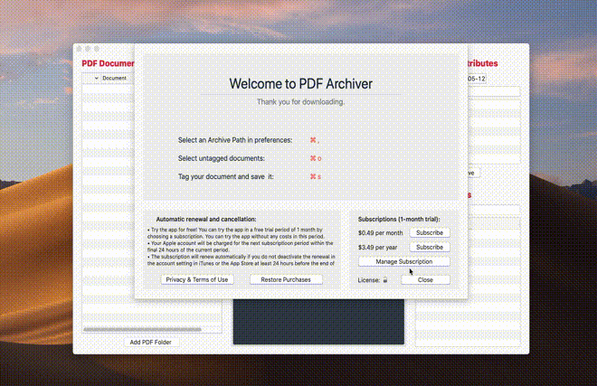

<div align="center">
<a href="https://geo.itunes.apple.com/us/app/pdf-archiver/id1352719750?mt=12&app=apps" target="itunes_store">
  
</a><br><br>

<a href="https://geo.itunes.apple.com/us/app/pdf-archiver/id1352719750?mt=12&app=apps" style="display:inline-block;overflow:hidden;background:url(https://linkmaker.itunes.apple.com/assets/shared/badges/en-us/macappstore-lrg.svg) no-repeat;width:165px;height:40px;background-size:contain;"></a><br>

[](https://travis-ci.org/PDF-Archiver/PDF-Archiver)
[](https://codeclimate.com/github/PDF-Archiver/PDF-Archiver/maintainability)
[](https://liberapay.com/juliankahnert/)
[](https://saythanks.io/to/JulianKahnert)
</div>

# PDF Archiver

<p align="center">

</p>

Archive all incoming documents digitally to access and search them in an easier way.
Transfer the sorted documents to your smartphone or make a backup within seconds.

* Scan all incoming bills, letters etc. and save them on your computer/iCloud in an *untagged* folder.
* Put the original paper documents in a folder, sorted by year. Don't care about bills/insurance papers etc.. Just leave all of them in one box for the each year.
* Open the **PDF Archiver** and start tagging. Your documents will be moved from the *untagged* to your *Archive* folder.

## :rocket: Usage
* Scan your documents, e.g. with [Scanbot](https://scanbot.io)
* Create an `Archive` folder in your iCloud Drive
* Select it in the *Preferences* panel (`⌘ ,` ...obviously)
* Start tagging your files

## :scroll: Convention
* **Date:** `yyyy-mm-dd` Date of the document content.
* **Description:** `--ikea-tradfri-gateway` Meaningful description of the document.
* **Tags:** `__bill_ikea_iot` Tags which will help you to find the document in your archive.
Capital letters, spaces and language specific characters (such as `ä, ö, ü, ß`) will be removed to maximize the filesystem compatibility.

Your archive will look like this:
```
.
└── Archive
    ├── 2017
    │   ├── 2017-05-12--apple-macbook__apple_bill.pdf
    │   └── 2017-01-02--this-is-a-document__bill_vacation.pdf
    └── 2018
        ├── 2018-04-30--this-might-be-important__work_travel.pdf
        ├── 2018-05-26--parov-stelar__concert_ticket.pdf
        └── 2018-12-01--master-thesis__finally_longterm_university.pdf
```

This structure is independent from your OS and filesystem and makes it very easy to search files ...
* ... by tag via a searchterm like: `_tagname`, starting with `_`
* ... by description via a searchterm like: `-descriptionword`, starting with `-`
* ... by tag or description via a searchterm like: `searchword`,  starting with the term
* ... and even the file content: have a look at the [Pro Tips](#pro-tips)!


## :floppy_disk: Installation
Download it from the Mac App Store:

<a href="https://geo.itunes.apple.com/us/app/pdf-archiver/id1352719750?mt=12&app=apps" style="display:inline-block;overflow:hidden;background:url(https://linkmaker.itunes.apple.com/assets/shared/badges/en-us/macappstore-lrg.svg) no-repeat;width:165px;height:40px;background-size:contain;"></a>

Or clone the repository and build it:
* Downloaded and install [Xcode.app](https://itunes.apple.com/app/xcode/id497799835)
* Get the project: `git clone --recurse-submodules https://github.com/PDF-Archiver/PDF-Archiver.git`
* Install the app: `cd PDF-Archiver && bash scripts/install_app.sh`
* Start **PDF Archiver** :rocket: (You might start the app a second time because of some app validation steps.)

## <a name="pro-tips"></a>:mortar_board: Pro Tips
### Scanbot
* **Easy document sync:** save your scans in iCloud Drive
* **Enable PDF content searching:** buy [Scanbot Pro](https://scanbot.io) and turn on [OCR](https://en.wikipedia.org/wiki/Optical_character_recognition)
* **Let PDF Archiver recognize the scan date:** set a compatible filename template
    * In your Scanbot App go to: `Preferences > Advanced Settings > Filename Template`
    * Choose: `[year]-[month]-[day]--Scanbot-[Hours][Minutes][Seconds]`

### PDF Archiver
* Use the `↹` key for fast field switching
* You can use keyboard shortcuts from the [FAQs](https://pdf-archiver.io/faq)

## :interrobang: Help
* Take a look at the [FAQs](https://pdf-archiver.io/faq).
* Get in contact with us at [Slack](https://pdf-archiver.slack.com).

## :octocat: How to contribute
Rate the App in the [Mac App Store](https://itunes.apple.com/app/id1352719750).

All [contributions](https://github.com/PDF-Archiver/PDF-Archiver/blob/develop/.github/CONTRIBUTING.md) are welcome!
Feel free to contribute to this project.
Submit pull requests or contribute tutorials - whatever you have to offer, it would be appreciated!

## :book: Thanks and Donations
* [**zngguvnf.org**](https://zngguvnf.org) discussing and creating this archive structure.
* [**Karl Voit**](http://karl-voit.at/managing-digital-photographs/) for the initial idea of a document naming convention.
* [**Nick Roach**](https://www.elegantthemes.com) for the [Icon](https://www.iconfinder.com/icons/1055071/document_file_icon).
* MAS Preview Sound: [Love Jones by @nop](http://dig.ccmixter.org/files/Lancefield/50789)

<noscript><a href="https://liberapay.com/JulianKahnert/donate"></a></noscript>
