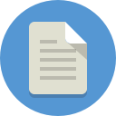

<p align="center">

</p>

# PDF Archiver
Toolkit for file tagging and archiving tasks.

This toolkit helps you to tag and archive files with following name convention:
```
date--name-with-description__tag1_tag2_tagN.pdf
2016-01-07--apple-macbook__apple_bill.pdf
```

## :rocket: Usage
* Scan your documents, e.g. with [Scanbot](https://scanbot.io)
* Create a `Archiv` folder in your iCloud Drive
* Start tagging your files


## :octocat: How to contribute
All contributions are welcome!
Feel free to contribute to this project.
Submit pull requests, contribute tutorials or other wiki content - whatever you have to offer, it would be appreciated!

## :scroll: Convention
* **Date:** `yyyy-mm-dd` Date of the document content
* **Description:** `--ikea-tradfri-gateway` Meaningful description of the document, `$CapitalLetters, $Spaces, ä, ö, ü, ß` will be replaced
* **Tags:** `__bill_ikea_iot` tags which will help you to find the document in your archive

## :mortar_board: Pro Tips
##### Scanbot
* **Easy document sync:** save your scans in iCloud Drive
* **Enable PDF content searching:** buy Scanbot Pro and turn on [OCR](https://en.wikipedia.org/wiki/Optical_character_recognition)
* **Let PDF Archiver recognize the scan date:** set a compatible filename template
    * In your Scanbot App go to: `Preferences > Advanced Settings > Filename Template`
    * Choose: `[year]-[month]-[day]--Scanbot-[Hours][Minutes][Seconds]__scan`

##### PDF Archiver
* Use keyboard shortcuts
    * `CMD o`: add new PDF documents
    * `CMD s`: save the current document in your archive
* Use the `TAB` key for fast field switching

## :book: Credits and Thanks

[zngguvnf.org](https://zngguvnf.org) for the initial idea of the naming convention.
