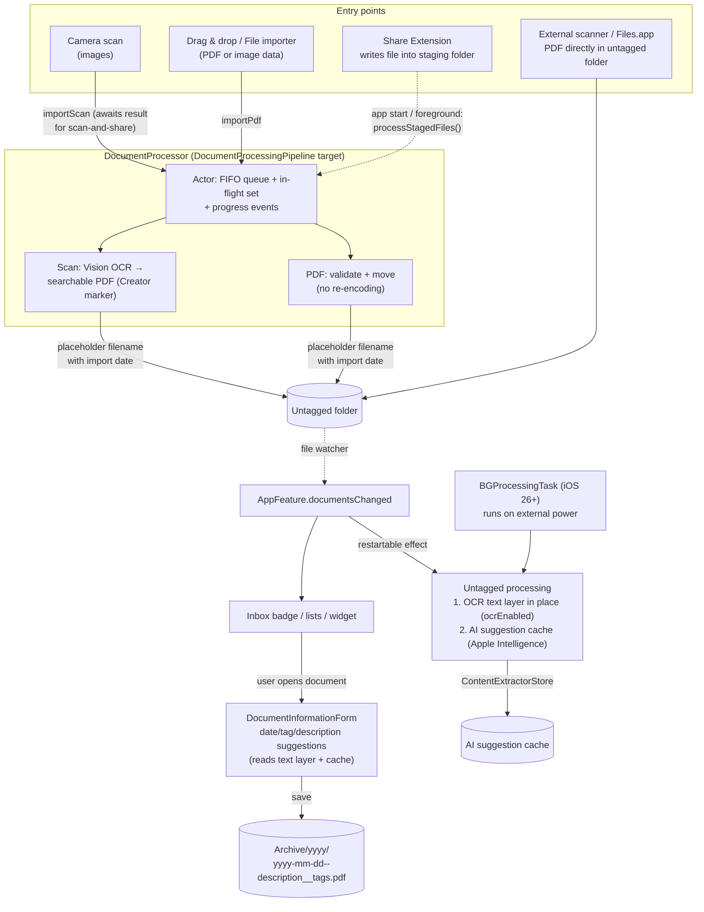

# Document Processing Flow

This document describes how documents move through the app: from the entry
points through the `DocumentProcessor` into the untagged folder, and how the
untagged processing adds OCR text layers and AI suggestion caches.

## Flow



## Components

| Component | Target | Responsibility |
|---|---|---|
| `DocumentProcessor` (actor) | `DocumentProcessingPipeline` | Accepts requests, serializes them in a FIFO queue, tracks progress events, runs the untagged processing |
| `PDFOCREngine` | `DocumentProcessingPipeline` | Vision OCR + invisible-text page rendering (scan → PDF and in-place OCR share one core) |
| `PDFMetadata` | `DocumentProcessingPipeline` | Text-layer probe and `Creator`-marker deduplication |
| `Staging` | `DocumentProcessingPipeline` | Crash-safe inbox handling (persist, group, delete after success) |
| `ContentExtractorStore` (actor) | `ContentExtractorStore` | Apple Intelligence: document text in → description + tags out, with file-based cache |
| `DocumentProcessingDependency` | `ArchiverFeatures` | TCA seam: resolves user settings + untagged folder into a `ProcessingConfig` per request |
| `BackgroundTaskManager` | `ArchiverFeatures` | iOS 26+ `BGProcessingTask` that runs the untagged processing on external power |
| `ArchiveStore` / `FolderProvider` | `ArchiverStore` | Watches archive + untagged folders and streams document changes to the UI |

The pipeline target depends only on `ArchiverModels` and `ContentExtractorStore`
(which itself depends only on `ArchiverModels`), so it can be reused outside the
app (e.g. in a future CLI).

## Configuration

The pipeline reads no settings. `DocumentProcessingDependency` resolves them
into a `ProcessingConfig` (destination folder, PDF quality, processed marker)
per request:

| Setting | Key | Effect |
|---|---|---|
| Automatic OCR for image PDFs | `ocrEnabled` (default `false`) | OCR pass of the untagged processing over *untagged* documents only. The OCR action in a document's info popover runs independently of the setting and works on archived documents as well. |
| Apple Intelligence + cache | `appleIntelligenceEnabled`, `appleIntelligenceCacheEnabled` | AI pass of the untagged processing |
| Custom prompt | `appleIntelligenceCustomPrompt` | Forwarded to the content extraction prompt |
| PDF quality | `pdfQuality` | JPEG compression of scanned pages and re-rendered OCR pages |

## Crash safety

Incoming documents are persisted in the staging folder (`TempDocuments`, the
App Group folder the Share Extension writes to) **before** they enter the
queue, and deleted only **after** the finished document was written to the
untagged folder. Files still in staging on the next launch are simply picked
up again by `processStagedFiles()` — worst case after a crash is a duplicate
import, never a lost document. Scan pages share a UUID filename prefix
(`<uuid>---<index>.jpg`) so an interrupted multi-page scan is recovered as one
document.

## OCR deduplication

Externally added PDFs without a text layer are OCR'd **in place** (filenames
untouched). To avoid re-processing on every pass, the `Creator` PDF attribute
is set to the versioned processed marker (`"PDF Archiver v<N>"`) after every
OCR attempt — including failed ones, which prevents retry loops. A document is
skipped only while its stamped version is at least the current engine version,
so raising `ProcessingConfig.ocrEngineVersion` grants every archived document
one further attempt:

```
Has text layer?                    → skip
Creator version >= engine version? → skip (already attempted by this engine)
otherwise                          → Vision OCR → invisible text layer → set Creator
```

`Creator` is used instead of `Producer` because `PDFDocument.write(to:)`
unconditionally overwrites `Producer` with the Quartz PDFContext value. A
cancelled OCR run (expiring background task) discards the partially modified
document *without* marking it, so it is retried on the next pass. An
unreadable text layer counts as no text layer (`TextReadability`), so such a
document is re-OCR'd as soon as the engine version advances past its stamp.

## Background task

One `BGProcessingTask` (`de.JulianKahnert.PDFArchiveViewer.pdf-processing`,
iOS 26+, `requiresExternalPower`) waits for the initial document load and runs
the same untagged processing as `documentsChanged`: OCR first, then the AI cache
pass, so text layers exist when cache entries are computed.
