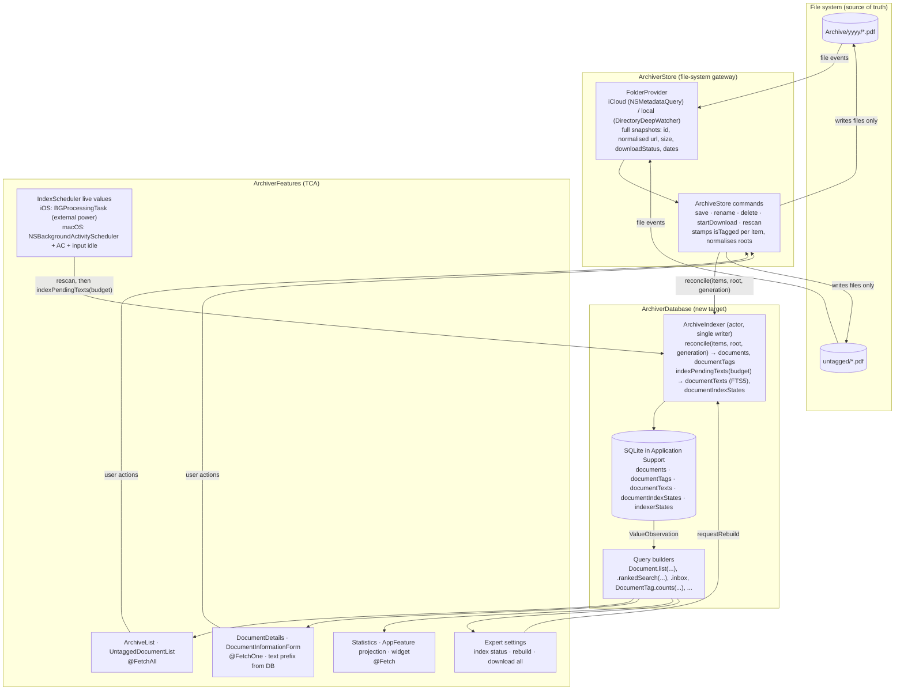

# Full-Text Search Concept

Status: draft for review, 2026-09-05. Branch base: `develop` at `fe0fcbfa`. Revised twice after
adversarial review (TCA and consistency; SQLiteData API, codebase fit, file system, concurrency and
platform APIs).

This document describes how full-text search over the PDF content is added to PDF Archiver, and
why that means replacing the in-memory document list with a SQLite read model built on
[SQLiteData](https://github.com/pointfreeco/sqlite-data). It is a concept, not an implementation
plan for one PR: section 12 cuts it into PRs.

## 1. Summary

The file system stays the source of truth. A local SQLite database becomes the **single read
model** for every screen, the full-text index is just one more query over it, and exactly one
component writes to it. Content search is a Premium feature and its index is built only in the
background while the device is on external power.

| Topic | Decision |
|---|---|
| Role of the database | Complete read model of the archive (documents, tags, extracted text, index state), not a side index for search only. Rebuildable at any time. |
| Read path | Features read with `@FetchAll` / `@FetchOne` / `@Fetch` directly in TCA state and views; reusable query builders are static extensions on the `@Table` types. No actor and no custom streams on the read side. |
| Write path | One actor (`ArchiveIndexer`, reached through a `@DependencyClient`) reconciles provider snapshots into the database and extracts PDF text. Nobody else writes. The optimistic in-memory edits `AppFeature` does today after `save` and `delete` are dropped; the UI follows the file-system event. |
| Storage | Application Support, one database per device, no sync. The Widget keeps its App Group `UserDefaults` projection (per-year counts plus untagged count). |
| Search engine | SQLite FTS5 (`unicode61 remove_diacritics 2`, prefix indexes), prefix-as-you-type from two characters, ranked with `bm25`. Core Spotlight (including the iOS 27 / macOS 27 generation) and macOS Spotlight metadata queries were evaluated and rejected (section 5). |
| Search UX | One search field. Free text matches filename **or** content. Content-only hits show a highlighted snippet. Filename hits rank first, then `bm25`. The result cap applies to ranked content searches only, never to the plain list. |
| Not-yet-downloaded iCloud files | Indexed as soon as they are local. Opt-in setting downloads the whole archive for a complete index. |
| Background only | Metadata reconciliation is immediate. Text extraction runs only on external power, at background QoS, while the user is not interacting: iOS `BGProcessingTask` (from the iOS 18 floor), macOS `NSBackgroundActivityScheduler` plus IOKit power check plus an input-idle guard. |
| Premium | Text index and content search only with active Premium, re-evaluated live. Filename search, the read model and the rebuild action stay free. |
| Settings | Expert settings get an index status line, "Download all documents for search" (Premium) and "Rebuild search index" (full read-model reset, everyone). |
| Identity | `Document.ID` stays the file system's `documentIdentifier`; the unstable `hashValue` fallback becomes a deterministic path hash. `ArchiveStore` delivers normalised snapshot items with id, taggedness and dates. |
| Delivery | Fixed target picture, delivered in PRs that each leave the app working. The dual-write intermediate state lives at most one release cycle. |

## 2. Goals and non-goals

Goals:

- Find archived documents by words inside the PDF, not only by filename, on iOS and macOS.
- One consistent way to read document state everywhere: lists, inbox, details, statistics, tag
  suggestions, search suggestions, widget counts.
- One consistent way to keep that state current, separate from reading it.
- Simpler previews, tests and screenshot fixtures through a database that is bootstrapped fresh per
  test, preview or screenshot run.
- The user never notices the index being built.

Non-goals:

- Showing documents in system-wide Spotlight (decision: no).
- Synchronising the index or the extracted text between devices.
- Running OCR inside the indexer. OCR stays in `DocumentProcessor`; the in-file `Creator` marker
  stays the truth for "already processed" (ADR 0001). The database may only *find* OCR candidates.
- Semantic or AI-ranked search. `SpotlightSearchTool` (iOS 27) is noted as a far-future idea in
  section 5.2 and nothing more.

## 3. Today

- Search filters the in-memory `@Shared(.documents)` array on `url.lastPathComponent`
  (`ArchiveList.State.getFilteredDocument()`, `ArchiverLib/Sources/ArchiverFeatures/ArchiveList/ArchiveList.swift:64-89`).
  Tokens `tag:`, `year:` and `text:` plus slugified free text. Nothing looks inside the PDF.
- `@Shared(.documents)` is a `FileStorageKey` on `documents.json` in the temporary directory
  (`ArchiverLib/Sources/Shared/Other/SharedKeys.swift:198-202`). It exists so the app shows the last
  known list at launch until the folder providers have delivered. It is rewritten on every change.
- `ArchiveStore` (actor) owns folder providers, keeps `currentDocuments`, yields full arrays on
  `documentsStream`, and computes tag suggestions from the array
  (`ArchiverLib/Sources/ArchiverStore/ArchiveStore.swift:86-108, 200-246`). `AppFeature` copies each
  array into `@Shared(.documents)`, derives top tags, years, widget counts and the untagged
  processing trigger from it (`AppFeature.swift:50-91, 204-221`), and edits the array optimistically
  on save and delete (`AppFeature.swift:137-171`).
- One provider per *unique parent folder*: `ArchiveStore.update` collapses `Archive/` and
  `Archive/untagged/` into one provider (`ArchiveStore.swift:76-79`, `Extensions/Array.swift:11-19`),
  so a snapshot mixes tagged and inbox files. Taggedness is decided per URL from untagged-folder
  membership **and** the filename pattern (`--`, `__`, no placeholder names,
  `ArchiveStore.swift:264-277`).
- Both providers yield **full snapshots** of `DocumentInformation(url, downloadStatus, sizeInBytes)`
  (`ArchiverStore/FolderAccess/FolderProvider.swift:16-24`, an internal type). There is no
  modification or creation date anywhere in the flow; `Document.create` reads the creation date from
  URL resource values as the date fallback for untagged files. `ICloudFolderProvider` already
  computes `url.uniqueId()` for its internal map.
- File URLs from the providers and the configured root can differ in the `/private` prefix on iOS
  (`ArchiveStore.swift:130-137`, `DocumentProcessor.swift:114-116`), and the iOS app container path
  contains a per-install UUID that changes with app updates.
- `Document.ID` is `documentIdentifier ?? path().hashValue` (`ArchiverStore/Extensions/URL.swift:16`).
  The fallback is seeded per process and therefore changes on every launch.
- Text is read from the PDF text layer with PDFKit on demand: the tagging form reads the first
  three pages for AI suggestions, date detection and tag detection (`TextAnalyserDependency`,
  `DocumentProcessor.extractText`). Image-only PDFs get a text layer from the OCR pass.
- The AI suggestion cache is one JSON file per document id under `Caches/ContentExtractor`.
- Statistics and the widget projection bucket **all** documents, untagged included, by
  `Calendar.current.component(.year, from: document.date)` (`Statistics.swift:37-41`,
  `WidgetStoreDependency.swift:33-43`); tab and search suggestions use tagged documents only
  (`AppFeature.swift:54-84`).
- `archiveStore.isLoading()` feeds `AppFeature.State.isDocumentLoading` (toolbar progress indicator
  and the scene-phase reload guard) and `Statistics.State.isLoading`.
- Background work exists only on iOS and is gated to iOS 26 (`BackgroundTaskManager`), although the
  `BackgroundTasks` API itself is iOS 13+. The gate was inherited from the FoundationModels-based
  AI cache. On a cold background launch the handler's first access to `archiveStore` is what
  instantiates `ArchiveStore.shared` and starts the folder scan. macOS has no background scheduling.
- Both `@main` initializers call `ScreenshotCase.prepareIfRequested()` first, which runs its own
  `prepareDependencies` with `context = .preview` (`ScreenshotCase.swift:45-53`).
- CI: GitHub Actions runs `ArchiverLib-CI.xctestplan` on macOS (`.github/workflows/pr.yml`); Xcode
  Cloud trusts macro plugins through a hard-coded allowlist in `ci_scripts/ci_post_clone.sh`.

## 4. Target architecture

### 4.1 Principles

1. **The file system is the truth.** Filenames carry date, description and tags; folder membership
   plus the filename pattern decide tagged vs. untagged. Nothing the user decides is stored only in
   the database.
2. **The database is the only read model.** Every feature reads it through SQLiteData's fetch
   wrappers. `@Shared(.documents)`, `currentDocuments`, `documentsStream` and `isLoadingStream` do
   not exist in the target state.
3. **One writer.** `ArchiveIndexer` is the only component that writes. It reconciles provider
   snapshots immediately and extracts text later. Everything in the database is derived from files
   and can be rebuilt.
4. **No shortcuts around the write path.** After `save`, `delete` or `startDownload` the UI waits
   for the file-system event. If latency becomes visible, the provider is nudged to rescan sooner;
   the path is never bypassed.
5. **Queries live where SQLiteData puts them.** Type-safe StructuredQueries, reusable as static
   extensions on the table types, no repository layer, no method-per-filter API. `#sql` only where
   the DSL cannot express a statement (the ranked search, section 8.2).
6. **Every side effect has a dependency seam.** The indexer and the platform schedulers are
   `@DependencyClient` structs with `previewValue`, `testValue` and `liveValue`, like every other
   dependency in the repository.
7. **The actor orders bookkeeping, the database serialises writes.** `ArchiveIndexer` is reentrant
   at every `await`; GRDB's `DatabasePool` has one writer connection, so transactions never
   interleave, but a reconcile *can* run between two extraction commits. The design expects that
   (section 7.2).

### 4.2 Component overview



### 4.3 Modules and dependencies

| Target | Change | Depends on |
|---|---|---|
| `ArchiverModels` | `Document` becomes the `@Table` type (see 6.2). Gains stored `filename`, `year`, `rootKey` and `contentModificationDate` columns and a deterministic id fallback helper. New public value `DocumentSnapshotItem` (the reconcile input, see 6.4). | `StructuredQueries` (macros and core only, **not** GRDB) |
| `ArchiverDatabase` (new) | Schema, migrations, `bootstrapDatabase()`, FTS5 table type, query builders, the `ArchiveIndexer` actor with its `ArchiveIndexerDependency` (`@DependencyClient`: `setObservedRoots`, `reconcile`, `indexPendingTexts`, `requestRebuild`), text extraction, and the `IndexSchedulerDependency` interface (`@DependencyClient`: `schedule`, `cancel`) whose live values live in `ArchiverFeatures`. Imports `SQLiteData` and, if `SQLiteData` does not re-export it, `StructuredQueriesSQLite` for the `FTS5` protocol. | `SQLiteData`, `ArchiverModels`, `Dependencies`, `DependenciesMacros`, PDFKit |
| `ArchiverStore` | Providers deliver id, normalised URL, size, download status, creation and modification dates; `ArchiveStore` stamps `isTagged` per item, normalises roots, forwards snapshots to the indexer dependency and loses all document state and tag-suggestion code. | + `ArchiverDatabase` |
| `ArchiverFeatures` | Every reader moves to fetch wrappers; search UI, settings, premium gate; `BackgroundTaskManager` (iOS) and a new `MacBackgroundActivity` (macOS) become the `IndexSchedulerDependency` live values because they also drive OCR and the AI cache, which `ArchiverDatabase` must not depend on. | + `ArchiverDatabase` |
| `ArchiverDatabaseTests` (new) | Reconciler, indexer, query builder, observation and migration tests. Declares its own `resources:` for PDF fixtures (SPM test targets cannot read another target's `Bundle.module`). Added to **both** `ArchiverLib.xctestplan` and `ArchiverLib-CI.xctestplan`. | `ArchiverDatabase`, `DependenciesTestSupport` |
| `ArchiverFeaturesTests` | Base suite bootstraps and seeds the database (section 11). | + `DependenciesTestSupport` |
| iOS / macOS app | One `prepareDependencies` block in each `@main` initializer: screenshot context override, `bootstrapDatabase()`, screenshot seed, in that order (section 11). | |
| CI | `ci_scripts/ci_post_clone.sh` `PACKAGES` gains `swift-structured-queries StructuredQueriesMacros` and `swift-structured-queries StructuredQueriesSQLiteMacros`; without them the first Xcode Cloud build fails on macro trust, independent of the `Package.resolved` check. | |

Why `Document` itself is the table: one type for domain and persistence is the consistent choice
the user asked for. A separate `DocumentRecord` plus mapping would be a second representation of the
same thing. The price is that `ArchiverModels` depends on StructuredQueries, which the Share
Extension (links the `Shared` product) and the Widget (links `ArchiverLib`) then carry. The Widget
additionally receives GRDB through `ArchiverFeatures`. Both are size-only costs; the binaries are
measured in the Phase 0 spike and the alternative (record type in `ArchiverDatabase`) is the fallback
if the delta is unacceptable.

### 4.4 What the database replaces

| Today | Target | Where |
|---|---|---|
| `@Shared(.documents)` + `documents.json` startup cache | Persistent database, `@FetchAll` | `SharedKeys.swift:198-202`, every `@Shared(.documents)` reader |
| `ArchiveStore.currentDocuments`, `documentsStream`, `isLoadingStream` | Tables plus a one-row `indexerStates` table whose `isReconciling` replaces `isLoading` one to one | `ArchiveStore.swift:25-28, 86-108` |
| `ArchiveStoreDependency.documentChanges`, `getDocuments`, `isLoading`, `getTagSuggestionsFor`, `getTagSuggestionsSimilarTo` | Removed. Tag suggestions become queries on `documentTags` | `ArchiveStoreDependency.swift:14-24` |
| `AppFeature.State.apply(documents:)` deriving top tags, years, suggested tokens, untagged count; `isDocumentLoading` | `@Fetch(AppProjectionRequest()) var projection = AppProjection()` with tagged-only years and top tags for the tabs, all-document year counts for the widget, `untaggedCount`, `isReconciling` (8.5) | `AppFeature.swift:40, 50-91, 223-225, 259-261, 471-480` |
| `AppFeature` optimistic `$documents` edits on save/delete | Removed; see 8.6 for the latency handling | `AppFeature.swift:137-171, 322-341` |
| `Statistics.State.apply(documents:)` loops and `isLoading` | `@Fetch(StatisticsRequest()) var stats = Statistics.Values()`; the fetch has a value immediately, the loading overlay goes | `Statistics.swift:21, 29-60, 154` |
| Selection via `Shared(state.$documents[id:])` | `DocumentDetails.State(document:)` seeded from the row the list already holds, kept live with `@FetchOne` | `ArchiveList.swift:111-119`, `UntaggedDocumentList.swift:40-51` |
| `selectNextDocument` walking the array | Next row after the current one in the ordered rows already in the list state | `AppFeature.swift:322-341` |
| `TextAnalyserDependency` re-reading the PDF when a document opens | Read a bounded prefix of `documentTexts.body` from the database (`substr(body, 1, N)`, N = 5,000 shared with `DocumentProcessor.extractText`); PDFKit only as fallback when the text is not indexed yet | `TextAnalyserDependency.swift:34-47` (Phase 4) |
| `ContentExtractorCache` JSON files | `documentSuggestions` table written by the same indexer | `ContentExtractorCache.swift` (Phase 4) |
| `ArchiveStoreDependency.previewValue` mock streams, `ScreenshotCase` seeding through `state.apply` and `isDocumentLoading = false` | Seeded database; the flag comes from the migration default | `ScreenshotCase.swift:45-106` |
| `WidgetStoreDependency.updateWidgetWith([Document])` | `updateWidget(yearCounts:untaggedCount:)`, fed by the observed projection instead of the array | `WidgetStoreDependency.swift:27-48` |

Kept on purpose: the in-file OCR marker (ADR 0001), `SharedDefaults` as the Widget's projection
(decision: database stays out of the App Group), `@Shared(.selectedDocumentId)` as pure UI state,
`ArchiveStore` as the only place that touches files, `@Dependency(\.archiveStore)` in the background
handler (it starts the scan and the opt-in downloads).

## 5. Alternatives considered

### 5.1 Additive side index for search only

Keep `@Shared(.documents)` and add a database with just extracted text. Rejected. Even that index
needs a bookkeeping table (path, size, modification date, index state) to detect staleness, which is
most of a read model already. Filters on tag, year and `isTagged` would have to be combined with FTS
hits per keystroke in memory, ranking across the two sources gets awkward, and statistics and tag
suggestions stay loops over an in-memory array. Two representations of the same documents would
have to be kept coherent forever.

### 5.2 Core Spotlight as the in-app engine, including iOS 27 / macOS 27

What is new in the 27 SDKs for Core Spotlight is small and aimed at language models, not at in-app
query engines: `SpotlightSearchTool` (a Foundation Models tool over an app's Spotlight index, gated
on Apple-Intelligence hardware), `CSSearchableIndexDescription`, the `SearchableItem` value type and
an async `searchableItems(forIdentifiers:)` delegate variant. `CSSearchQuery`, `CSUserQuery` and
`CSUserQueryContext` gained nothing in 27; the lexical and ranked query APIs already exist on the
iOS 18 / macOS 15 floors. Apple's "Core Spotlight updates" page lists exactly those items for 2026.

| Criterion | Core Spotlight (iOS 27 generation) | SQLite FTS5 (own index) |
|---|---|---|
| Availability vs. iOS 18 / macOS 15 floors | Lexical queries iOS 10+, ranked/semantic iOS 18+, all 27 additions need iOS 27 and Apple-Intelligence hardware | Every supported device |
| Visibility | Indexed items are, by design, discoverable in system Spotlight and Safari. No API for an in-app-only index was found in the iOS 26.5 SDK headers or Apple's docs. The only opt-out is the user's "Show Content in Search" toggle | Text never leaves the app container |
| Joins with tag/year filters | Predicate strings over donated attributes (`filterQueries`), no relational joins, no aggregates | Native SQL joins and aggregates |
| Ranking control | Opaque ML ranking, `rankingHint` 0–100, engagement signals | `bm25` with column weights, deterministic ordering |
| Snippets and highlights | None for items. Indexed `textContent` is stored "searchable but not recoverable" (WWDC26 session 246); `kMDItemTextContent` is explicitly not readable. Snippets would need an own text store anyway | `snippet()` and `highlight()` built in |
| Testability | Needs the Spotlight daemon and a signed app process, asynchronous and throttled indexing, non-deterministic ranking | In-process, deterministic, fresh database per test |
| Rebuild semantics | System may request `reindexAll` at any time and expects a reindexing extension when the app is not running; undocumented per-bundle quota (`CSIndexErrorCodeQuotaExceeded`) | App-owned, on the app's schedule |
| Reliability reports | `textContent` and `keywords` not matching on iOS 17/18 in developer threads; Apple DTS: Core Spotlight's goal is system-wide discoverability, "NOT (necessarily) to serve as the full search system for all of your content" | Well understood |

Rejected as engine. `SpotlightSearchTool` could become an opt-in "ask your archive" feature much
later, but it would require re-deciding the "no system Spotlight" decision and Apple-Intelligence
hardware. Not part of this concept.

### 5.3 macOS Spotlight metadata query (`kMDItemTextContent`)

macOS already indexes PDF text for local and downloaded iCloud Drive files, and `NSMetadataQuery`
can filter on `kMDItemTextContent`. Rejected: the attribute and `NSMetadataQueryLocalComputerScope`
are macOS-only, iOS `NSMetadataQuery` supports only ubiquitous scopes, evicted iCloud files are not
content-searchable, and the text cannot be read back for snippets. It would split the engine per
platform and leave iOS without content search.

### 5.4 Synchronising extracted text with CloudKit (`SyncEngine`)

SQLiteData can sync tables through CloudKit. Rejected for now: it adds the CloudKit entitlement and
remote notifications, puts every document's text into the private CloudKit database, introduces
quota and conflict handling, and FTS5 virtual tables cannot be synced anyway (the index would be
derived locally regardless). A fresh device rebuilds its index in the background instead. Nothing in
the schema prevents adding `SyncEngine` later, except that synced tables must not drop or rename
columns afterwards.

### 5.5 Database in the App Group container

Would let the Widget read its per-year counts and the untagged count with `@Fetch` and remove
`SharedDefaults`. Both options were weighed with the user; decision: the database stays in
Application Support. Multi-process SQLite in a shared container needs GRDB's suspension handling to
avoid `0xdead10cc` terminations when iOS suspends the app while it holds a lock, and the projection
is a handful of integers written after each reconcile. Reopen only if the Widget ever needs more
than counts.

### 5.6 Trigram tokenizer for substring matching

`trigram` (SQLite 3.34+) would find `nung` in `Rechnung`, which suits German compounds, at roughly
three times the index size and a three-character minimum query length. Decision: `unicode61` with
prefix queries and prefix indexes. The tokenizer is a `CREATE VIRTUAL TABLE` option, so switching
later is one migration plus a rebuild.

## 6. Data model

### 6.1 Schema

Written as `#sql` in one `DatabaseMigrator` migration ("Create the read model"), `STRICT` tables, as
the SQLiteData guidance requires. Nothing has shipped from this branch, so the schema is created in
its final shape rather than through a chain of migrations, and `eraseDatabaseOnSchemaChange` is set
in `DEBUG` so a stale local database is rebuilt from the file system instead of migrated.

```sql
-- "Create the read model"
CREATE TABLE "documents" (
  "id" INTEGER PRIMARY KEY NOT NULL,          -- documentIdentifier, see 6.3 (no AUTOINCREMENT)
  "rootKey" TEXT NOT NULL,                    -- logical observed root, see 7.1 (not the root path)
  "url" TEXT NOT NULL,                        -- normalised absolute file URL; indexed, NOT unique (see note)
  "filename" TEXT NOT NULL,                   -- lastPathComponent, kept for LIKE filters
  "date" TEXT NOT NULL,                       -- ISO-8601, SQLiteData default representation
  "year" INTEGER NOT NULL,                    -- Calendar.current year of `date`, computed on reconcile (see note)
  "specification" TEXT NOT NULL DEFAULT '',
  "tags" TEXT NOT NULL DEFAULT '[]',          -- JSON array, sorted by a custom representation (6.2)
  "isTagged" INTEGER NOT NULL DEFAULT 0,
  "sizeInBytes" REAL NOT NULL DEFAULT 0,
  "downloadStatus" REAL NOT NULL DEFAULT 0,
  "contentModificationDate" TEXT              -- from the provider, nil when unknown
) STRICT;
CREATE INDEX "index_documents_on_rootKey" ON "documents"("rootKey");
CREATE INDEX "index_documents_on_url" ON "documents"("url");
CREATE INDEX "index_documents_on_isTagged_date" ON "documents"("isTagged", "date");
CREATE INDEX "index_documents_on_year" ON "documents"("year");

CREATE TABLE "documentTags" (                 -- derived from documents.tags, for aggregates; rowid table (see note)
  "documentID" INTEGER NOT NULL REFERENCES "documents"("id") ON DELETE CASCADE,
  "tag" TEXT NOT NULL,
  PRIMARY KEY ("documentID", "tag")
) STRICT;
CREATE INDEX "index_documentTags_on_tag" ON "documentTags"("tag");

CREATE TABLE "indexerStates" (                -- exactly one row, id = 1
  "id" INTEGER PRIMARY KEY NOT NULL CHECK ("id" = 1),
  -- a metadata reconcile is running and nothing is stored yet for the observed roots
  "isReconciling" INTEGER NOT NULL DEFAULT 0,
  "lastTextRunFinishedAt" TEXT,
  "rebuildRequested" INTEGER NOT NULL DEFAULT 0
) STRICT;
INSERT INTO "indexerStates" ("id") VALUES (1);

CREATE VIRTUAL TABLE "documentTexts" USING fts5(
  "body",
  tokenize = 'unicode61 remove_diacritics 2',
  prefix = '2 3'                              -- prefix indexes for two- and three-character prefixes
);
-- rowid = documents.id. The text is stored in the FTS table itself (no content= option), so the
-- single writer inserts, updates and deletes rows directly and no triggers are needed.

CREATE TABLE "documentIndexStates" (          -- text-extraction bookkeeping, one row per indexed document
  "documentID" INTEGER PRIMARY KEY NOT NULL REFERENCES "documents"("id") ON DELETE CASCADE,
  "sourceSize" REAL NOT NULL,
  "sourceModificationDate" TEXT,
  "indexedAt" TEXT NOT NULL,
  "outcome" TEXT NOT NULL,                    -- indexed | noText | unreadable | failed
  "characterCount" INTEGER NOT NULL DEFAULT 0,
  "extractorVersion" INTEGER NOT NULL DEFAULT 1
) STRICT;

CREATE TABLE "documentSuggestions" (          -- replaces the ContentExtractorCache JSON files
  "documentID" INTEGER PRIMARY KEY NOT NULL REFERENCES "documents"("id") ON DELETE CASCADE,
  "specification" TEXT NOT NULL DEFAULT '',
  "tags" TEXT NOT NULL DEFAULT '[]',
  "createdAt" TEXT NOT NULL,
  "modelVersion" INTEGER NOT NULL DEFAULT 1
) STRICT;
```

Notes:

- `url` is indexed but **not** `UNIQUE`. Uniqueness is a property of a full snapshot and is enforced
  by the reconciler's diff (7.1); a constraint would only turn edge cases (a file replaced at the same
  path within one watcher debounce, a rename chain, an A↔B swap inside one snapshot) into a failed
  transaction that repeats on every later snapshot. Rebuild repairs the read model if the diff ever
  gets it wrong.
- `rootKey` is a logical key for the observed root (`icloud`, `appContainer`, or the chosen folder's
  normalised path on macOS), written by the reconciler from the `root` argument. Root membership is
  never derived from the URL text: the same file appears as `/private/var/...` and `/var/...` on iOS,
  and the app-container path changes with app updates.
- `documentTags` is a normal rowid table on purpose. SQLite's update hook does not fire for
  `WITHOUT ROWID` tables, and GRDB's `ValueObservation` (what every fetch wrapper is built on)
  documents that changes to such tables are undetectable; an observation whose region is only
  `documentTags` (tag suggestions in the tagging form) would never refresh.
- `documentTexts` stores the text itself rather than mirroring a separate content table. The
  SQLiteData guidance prefers temporary triggers for FTS mirrors, but with one writer that writes
  both rows in one transaction there is nothing to mirror. This removes the question of on which
  connection temporary triggers must live, and `body` is still readable by rowid for the tagging
  form (Phase 4). If a second consumer of the raw text ever needs a plain table, the text moves to a
  regular `documentBodies` table and `documentTexts` becomes an external-content FTS table over it
  (`content='documentBodies'`) plus triggers, in one migration.
- Virtual tables cannot carry foreign keys, and SQLite's UPSERT (`ON CONFLICT DO UPDATE`, what
  StructuredQueries' `upsert` emits) is not implemented for virtual tables. The indexer therefore
  writes `documentTexts` as delete + insert inside the per-document transaction and deletes the row
  in the same transaction that deletes the document.
- `prefix = '2 3'` makes two- and three-character prefix queries index lookups instead of range
  scans over every term starting with those letters. The content half of the search joins only from
  two typed characters (8.3).
- `documentTags` duplicates `documents.tags` on purpose: the JSON column keeps `Document.tags` a
  plain property for the UI and the filename helpers, the join table makes `GROUP BY tag`, prefix
  suggestions and co-occurrence queries type-safe and indexable. Both are written in one
  transaction by the one writer. `json_each` over the JSON column is the alternative if the
  duplication proves annoying.
- `date` is stored as ISO-8601 with time in UTC. Filename dates are local calendar days, so a
  document dated 2024-01-01 in Berlin becomes `2023-12-31T23:00:00Z`. Sorting is unaffected, but
  every year bucket must not use `date`. The `year` column is what today's code computes
  (`Calendar.current.component(.year, from: date)`): for tagged documents that is the filename's
  `yyyy`, for untagged documents the creation-date fallback's year. The `year:` token, Statistics
  and the widget projection all use it. A device timezone change does not rewrite existing rows;
  the next reconcile of a changed row recomputes it, which matches today's behaviour closely enough.
- `remove_diacritics 2` (SQLite 3.27+) folds all Latin diacritics correctly; `1` is documented as
  buggy for multi-codepoint characters. System SQLite is 3.39 on iOS 16.7 (verified) and very
  likely 3.43 on the iOS 18 / macOS 15 floors; every FTS5 feature used here needs at most 3.34.
  FTS5 is compiled into the system library, GRDB links the system library and defines
  `SQLITE_ENABLE_FTS5` by default since 6.7.0.
- Index maintenance uses the incremental `merge` command once per background run
  (`INSERT INTO documentTexts(documentTexts, rank) VALUES('merge', 16)`) in its own short
  transaction. `optimize` merges every segment in one transaction and can take minutes on a large
  index, which does not fit an expirable background budget; it runs only when a rebuild completes
  and the run still has budget.

### 6.2 Swift types

```swift
// ArchiverModels
@Table
nonisolated public struct Document: Equatable, Hashable, Sendable, Codable, Identifiable {
    public typealias ID = Int
    public var id: ID
    public var rootKey: String
    public var url: URL                                   // URL is QueryBindable (stored as text)
    public var filename: String                           // stored, replaces the computed property
    public var date: Date
    public var year: Int                                  // Calendar.current year of `date`, see 6.1
    public var specification: String
    @Column(as: SortedTagsRepresentation.self)            // encodes Set.sorted() as a JSON array, see below
    public var tags: Set<String>
    public var isTagged: Bool
    public var sizeInBytes: Double
    public var downloadStatus: Double
    public var contentModificationDate: Date?
}

/// What ArchiveStore hands to the reconciler for one file. Public so ArchiverStore (producer) and
/// ArchiverDatabase (consumer) share it without a module cycle.
public struct DocumentSnapshotItem: Equatable, Sendable {
    public let id: Document.ID
    public let url: URL                                   // normalised (standardizedFileURL, symlinks resolved)
    public let isTagged: Bool                             // folder membership AND filename pattern, decided by ArchiveStore
    public let sizeInBytes: Double
    public let downloadStatus: Double
    public let creationDate: Date?                        // date fallback for untagged files
    public let contentModificationDate: Date?
}

// ArchiverDatabase
@Table struct DocumentTag { let documentID: Document.ID; let tag: String }          // no primary key, no Draft

@Table struct DocumentIndexState: Identifiable {
    @Column(primaryKey: true) let documentID: Document.ID
    var id: Document.ID { documentID }
    var sourceSize: Double
    var sourceModificationDate: Date?
    var indexedAt: Date
    var outcome: Outcome                                  // String-backed enum, QueryBindable via RawRepresentable
    var characterCount: Int
    var extractorVersion: Int
}

@Table struct DocumentText: FTS5, Identifiable {
    @Column(primaryKey: true) let rowid: Document.ID
    var id: Document.ID { rowid }
    let body: String
}

@Table struct IndexerState: Identifiable {                 // single row, id == 1
    let id: Int
    var isReconciling: Bool
    var lastTextRunFinishedAt: Date?
    var rebuildRequested: Bool
}

@Table struct DocumentSuggestion: Identifiable {           // Phase 4
    @Column(primaryKey: true) let documentID: Document.ID
    var id: Document.ID { documentID }
    var specification: String
    @Column(as: [String].JSONRepresentation.self) var tags: [String]
    var createdAt: Date
    var modelVersion: Int
}
```

`SortedTagsRepresentation` is a small custom `QueryRepresentable` (the same mechanism as
`JSONRepresentation`) that encodes `Set<String>` as a JSON array of `sorted()` elements. The stock
`Set<String>.JSONRepresentation` would encode in hash order, which differs per process; a stable
column text keeps diffs and debugging sane. The reconciler's "unchanged row" comparison uses the
Swift values, never the column text.

`Document` keeps `Codable`, `Hashable`, `createFilename`, `parseFilename` and `mock`. `mock` gets a
deterministic id (see 6.3) so previews and tests stop depending on `URL.hashValue`. The stored
`filename` is `lastPathComponent`; `parseFilename` already tolerates the `.pdf` suffix, so the
providers no longer need `localizedName`.

### 6.3 Identity

`Document.ID` stays the file system's `documentIdentifier`: kernel-assigned, survives renames and
moves within a volume, survives safe-saves (PDFKit's `write(to:)` is one, verified on APFS: the id
is unchanged across the OCR and keywords rewrites), persists across restarts, and therefore survives
an index rebuild. That matters because `selectedDocumentId`, the suggestion cache and the screenshot
fixtures hold ids, and because tagging a document inside the archive tree *renames* it. A database
autoincrement would change every id on rebuild.

Changes and facts to keep in mind:

- The fallback `path().hashValue` is replaced by a deterministic 64-bit hash of the normalised path
  (FNV-1a or SipHash with a fixed key), implemented once in `ArchiverModels` and used both in
  `URL.uniqueId()` and in `ICloudFolderProvider`'s internal map (`ICloudFolderProvider.swift:115`).
  The kernel assigns document ids lazily and only to tracked files, so plain local files hit the
  fallback more often than iCloud files; a rename of such a file is a delete plus insert and
  re-extracts the text, which is cheap.
- The provider computes the id and puts it into `DocumentSnapshotItem`; the indexer never touches
  URL resource values (they return stub data for undownloaded iCloud items anyway).
- Tagging a document that lives in a *different* provider than the archive (macOS `observedFolder`
  outside the archive tree) is copy + delete in `ArchiveStore.save` (`fetch`, `save(data:)`,
  `delete`; `ArchiveStore.swift:163-169`), so the new file gets a new `documentIdentifier` on any
  volume, its text is re-extracted, and the selection is already cleared by the save flow. Only
  external moves by the Finder within one volume keep the id.
- Known, pre-existing limitation: `documentIdentifier` is unique per volume. Two observed folders
  on different volumes could collide. If that ever matters, the id becomes a hash of
  `(volumeUUIDString, documentIdentifier)`; nothing outside the database depends on the raw value.
- The iOS app-container path changes with app updates. Rows for local storage then carry stale
  URLs until the first reconcile after launch, which matches them by id and rewrites the URL (the
  system moves the container, so inodes and document ids survive). `rootKey` is logical for exactly
  this reason. Between launch and that reconcile (seconds) a stale row cannot be opened; accepted.
- Existing `ContentExtractorCache` files keyed by old fallback hashes become orphans and are pruned
  on the next pass. One-time cache loss, harmless.

### 6.4 Snapshot items and change detection

`DocumentInformation` stays internal to `ArchiverStore`. The providers extend it with `id`,
`creationDate` (`.creationDateKey` locally, `NSMetadataItemFSCreationDateKey` for iCloud) and
`contentModificationDate` (`.contentModificationDateKey` locally, `NSMetadataItemFSContentChangeDateKey`
for iCloud; both metadata keys work before download), and normalise every URL with
`standardizedFileURL.resolvingSymlinksInPath()`. `ArchiveStore` maps each entry to a public
`DocumentSnapshotItem`, stamping `isTagged` with its existing per-URL rule (untagged-folder
membership and filename pattern) because only it knows `untaggedFolders`.

A document's text is (re-)extracted when no `documentIndexStates` row exists, when `sourceSize` or
`sourceModificationDate` differ from the row, or when `extractorVersion` is below the current one.

iCloud occasionally bumps modification dates without content changes; that costs a spurious
re-extraction, never a missed one. Hashing file contents is not needed. `generationIdentifier` is
the cheaper alternative if spurious runs ever hurt.

An OCR pass and `ArchiveStore.save` (keywords attribute) both rewrite the PDF in place and bump the
date, so a document that gained a text layer is re-indexed automatically. Whether `NSMetadataQuery`
reports an in-place rewrite by the same process as a changed item is a Phase 0 check (section 14);
if not, `DocumentProcessor` asks `ArchiveStore` to rescan after an OCR run.

### 6.5 Deviations from SQLiteData and StructuredQueries defaults

| Guidance | Deviation | Why |
|---|---|---|
| Prefer UUID primary keys with `DEFAULT (uuid())` | `INTEGER PRIMARY KEY` set by the app | The id is the file system's identifier and doubles as the FTS5 rowid |
| Prefer temporary triggers for FTS mirrors | No triggers | The FTS table is the text store and has one writer (6.1) |
| Prefer `upsert` for insert-or-update | Delete + insert on `documentTexts`; `upsert` only on regular tables | SQLite does not implement UPSERT for virtual tables |
| Model natural uniqueness as `UNIQUE` | `url` only indexed | Uniqueness is guaranteed by the snapshot diff; a constraint would wedge the reconcile on rename chains and same-path replacements (6.1) |
| Prefer the DSL over `#sql` | The ranked search is one `#sql` statement | `leftJoin(statement)` merges the joined statement's `WHERE` into the main query and cannot join a MATCH subselect; the snippet must be computed after `LIMIT` (8.2) |
| `defaultDatabase()` picks the file name | Default kept | Application Support is the decided location; the guidance documents the automatic preview/test switch only for the default call |
| `sectionBy:` for grouped lists | Not used | The list is flat and sorted by date today; the bundled interface does not expose sectioning, so it is not relied upon |

## 7. Write path

### 7.1 Reconciliation (immediate)

`ArchiveStore` keeps creating providers per unique root (with `getUniqueParents` fixed to compare
`path + "/"` so `Archive2` is no longer a child of `Archive`). Whenever it (re)creates providers it
first announces the observed roots and receives a generation:

```swift
// ArchiveStore.update(archiveFolder:untaggedFolders:)
@Dependency(\.archiveIndexer) var indexer
let roots = providers.map { RootKey(for: $0.baseUrl) }          // only roots whose provider was created
let generation = await indexer.setObservedRoots(roots)

// per provider task
for await snapshot in provider.currentDocumentsStream {
    guard !Task.isCancelled else { break }
    let items = snapshot.map { DocumentSnapshotItem($0, isTagged: isTagged($0.url)) }
    await indexer.reconcile(items, root: rootKey, generation: generation)
}
```

`setObservedRoots` stores the set and a new generation on the actor and raises
`indexerStates.isReconciling` only when nothing is stored yet for those roots, so a warm launch and
every rescan after it show the stored rows instead of a spinner. Rows of roots that are no longer
observed are *not* deleted here: a provider that fails to start is a transient condition, and
`rootKey NOT IN ()` is true in SQLite, so an empty set would delete the whole archive. They are
dropped in the first write of the new generation instead. `reconcile` runs on the actor and:

0. Drops the snapshot without touching the database if `root` is not in the observed set or
   `generation` is stale. Cancelled provider tasks can still deliver buffered snapshots, and actor
   jobs are not strictly FIFO, so this check is what prevents ghost rows after a storage switch.
1. Computes the diff against the rows with this `rootKey` **before** writing anything: matches
   snapshot items to rows by `id`, then by `url`.
2. In one deletion transaction, then in write transactions of 250 rows each, ordered `date`
   descending so the top of the archive list is right as soon as the first chunk commits:
   - the deletion transaction first: rows of this root that are absent from the snapshot (cascades
     remove `documentTags`, `documentIndexStates`, `documentSuggestions`; the `documentTexts` row
     is deleted explicitly), plus the rows of roots this generation no longer observes. Deletions
     are never chunked, so a rename chain or an A<->B swap can never collide with a row this very
     snapshot removes;
   - for "same `url`, different `id`" (a file replaced at its path, an evicted placeholder that
     gained a real id): delete the old row and insert the new one; the text is re-extracted because
     the new id has no `documentIndexStates` row. Primary keys are never updated;
   - rows with a new `url` (rename, move) get `url`, `filename`, `isTagged` and the re-parsed
     `date`, `year`, `specification` and `tags`; the id and the indexed text survive. Swaps inside
     one snapshot are fine because `url` is not unique;
   - unchanged rows (same `url`, `isTagged`, `sizeInBytes`, `downloadStatus`,
     `contentModificationDate`, compared as Swift values) are skipped. Dates are truncated to the
     millisecond the `TEXT` columns keep, at the `DocumentSnapshotItem` boundary, so a stored date
     equals the one the file system reports and an unchanged snapshot writes nothing at all;
   - new items are inserted with `Document.create` semantics: filename parsing, the delivered
     `creationDate` as date fallback, `year` from `Calendar.current`. The parse of a whole snapshot
     runs off the actor in one `@concurrent` batch;
   - `documentTags` is rewritten for every inserted or renamed document;
   - once every observed root has delivered its first snapshot of the current generation,
     `isReconciling` is cleared.

   A partially applied snapshot is therefore observable, by design: the file system is the source of
   truth (`docs/adr/0003-database-is-a-derived-read-model.md`), and a generation that goes stale
   mid-way stops at the next chunk boundary and leaves valid rows behind.
3. If the write throws, the error is reported through `withErrorReporting` and the root is retried
   once with a "replace root" strategy (delete all rows of the root, insert the snapshot). A failed
   reconcile never poisons later snapshots.

`bootstrapDatabase()` resets `isReconciling` to `0` so a crash mid-scan cannot leave it stuck; roots
whose provider failed to start are not in the observed set, so they cannot keep the flag up. With
chunking, whatever committed before the crash is valid and the next snapshot reconciles the rest.

Because both providers deliver full snapshots this is a diff, not an event replay. An empty first
snapshot from a provider whose root exists is a legitimate "folder is empty" and deletes that root's
rows; a provider that fails to start yields nothing and its rows stay until a live root reports.
The `ICloudFolderProvider` internally knows added/changed/removed items but discards that before
yielding; exposing deltas is a possible later optimisation, not a requirement.

`downloadStatus` changes arrive frequently while a file downloads. They are written in the same
chunks as everything else; `ValueObservation` coalesces the UI updates.
A reconcile may run between two extraction commits (4.1 principle 7); section 7.2 says why that is
safe.

### 7.2 Text extraction (deferred)

`ArchiveIndexer.indexPendingTexts(budget:)` is only ever called by the platform scheduler live
values (section 7.3), never from a user action. A rebuild request (7.6) only *schedules* such a run.

Metadata first, enforced in code: the run returns immediately while `indexerStates.isReconciling` is
true, before any bookkeeping, so the next scheduled run simply repeats the attempt. The list is what
the user is waiting for, and a text commit would otherwise queue ahead of a reconcile chunk on the
single writer connection.

```
pending = documents d
          LEFT JOIN documentIndexStates s ON s.documentID = d.id
          WHERE d.downloadStatus >= 1
            AND (s.documentID IS NULL
                 OR s.sourceSize != d.sizeInBytes
                 OR s.sourceModificationDate IS NOT d.contentModificationDate
                 OR s.extractorVersion < :current)
          ORDER BY d.isTagged ASC, d.date DESC          -- inbox first, newest first
```

Per pending row, until the budget is exhausted or the task is cancelled:

1. The actor hands `(id, url, sizeInBytes, contentModificationDate)` to a `@concurrent nonisolated
   static func extract(...)`, the same shape as `DocumentProcessor.extractText`. Under
   `NonisolatedNonsendingByDefault` an ordinary `async` helper would run on the indexer's executor
   and stall every reconcile behind a PDF parse; `@concurrent` is what moves it off the actor and
   off the main actor.
2. The helper opens `PDFDocument(url:)`: one document per call, never shared (PDFKit is not
   documented thread-safe), never through a coordinated read (it blocks until an iCloud file is
   downloaded). Only `downloadStatus == 1` rows are opened; how `PDFDocument(url:)` behaves on a
   placeholder is undocumented and stays a spike. It appends `page.string` page by page, each page
   inside `autoreleasepool` (a synchronous closure, so it wraps the PDFKit calls, not the async
   flow), checks `Task.isCancelled` after every page, and stops at a per-document cap (proposal:
   1,000,000 characters) so one pathological file cannot dominate the index.
3. Back on the actor, one `database.write`: re-read the `documents` row; if it is gone, or its
   `sizeInBytes` / `contentModificationDate` differ from the values captured in step 1, skip (the
   next run picks the new version up). Otherwise `DocumentText.find(id).delete()` then
   `DocumentText.insert { DocumentText(rowid: id, body:) }` (no UPSERT on virtual tables), and
   `upsert` the `documentIndexStates` row with the **captured** size and date, never the current
   row's, so an in-place rewrite during extraction leaves a mismatch the next run detects. Empty
   text gives outcome `noText`; a failed `TextReadability.isReadable` check gives `unreadable` and
   no FTS row (mojibake would pollute search).
4. Commit per document; an error for one document is reported and skipped, never aborts the run. An
   interrupted transaction is rolled back atomically by SQLite, which is what makes per-document
   commits safe under task expiry or process termination.
5. At the end of a run, if budget remains: one `merge` step (6.1); after a completed rebuild,
   `optimize`.

`documentIndexStates.outcome` also answers "which documents have no usable text" for the OCR pass,
without touching the in-file marker.

### 7.3 Scheduling: "the user never notices"

Metadata reconciliation is cheap and runs whenever a snapshot arrives, in the foreground too, as it
replaces today's list update. Text extraction is the expensive part and follows these rules on
both platforms: only while on external power, only at background QoS, only in small budgets with
per-page cancellation and per-document checkpoints, never while the user is interacting with the
app.

The schedulers are the live values of `IndexSchedulerDependency` and live in `ArchiverFeatures`,
because the same runs also drive OCR and the AI cache (`DocumentProcessingPipeline`,
`ContentExtractorStore`), which `ArchiverDatabase` must not depend on.

iOS (`BackgroundTaskManager`):

- The `@available(iOS 26, *)` gate is dropped. `BGProcessingTask` is iOS 13+, the Info.plist already
  lists the identifier and `UIBackgroundModes` `processing`. The FoundationModels AI pass inside
  keeps its own `#available(iOS 26, *)` check.
- One `BGProcessingTaskRequest` with `requiresExternalPower = true` and
  `requiresNetworkConnectivity = false` (or `true` when the opt-in download is enabled, see 7.4).
- A cold background launch has no scene, so nothing else starts the folder scan. The handler
  therefore first calls `try await archiveStore.reloadDocuments()` (which runs `update`, hence
  `setObservedRoots`, which raises `isReconciling` before the call returns), then waits for
  `indexerStates.isReconciling == false` with the existing 30-second cap, runs OCR (existing), then
  `indexPendingTexts`, then the AI cache pass, then reschedules. `bootstrapDatabase()` runs in
  `@main.init` before any handler can fire, so its flag reset cannot race the wait.
- The expiration handler cancels the indexer task; extraction observes cancellation per page, so the
  task returns within a page's parse time, after which the handler calls `setTaskCompleted`, as it
  does today. A short hard fallback (complete after a few seconds even if the task has not returned)
  guards against a pathological page.
- The system runs processing tasks only while the device is idle and terminates them when the user
  starts using it, which is the "never while interacting" rule for free.
- `BGContinuedProcessingTask` (iOS 26) is not used: it is for user-initiated work shown in a Live
  Activity and Apple advises against automatic maintenance in it.
- Budget: the system grants "several minutes" while idle and charging. A large archive may take
  several nights. That is accepted; the settings screen shows progress.

macOS (`MacBackgroundActivity`, new):

- `BackgroundTasks` is `API_UNAVAILABLE(macos)` for native apps. The equivalent is
  `NSBackgroundActivityScheduler(identifier:)` with `repeats = true`, `interval` around 15 minutes,
  `qualityOfService = .background`; the system picks a moment based on energy and thermal state and
  wraps the block in `ProcessInfo.beginActivity`. The block runs on a serial background queue; it
  starts a `Task` for the async indexer.
- The scheduler has no "AC only" and no "user idle" flag, so the block checks before starting and
  between documents:

  ```swift
  // External power. Both calls follow the Copy rule; the CFString is bridged with Foundation imported.
  guard let snapshot = IOPSCopyPowerSourcesInfo()?.takeRetainedValue(),
        let type = IOPSGetProvidingPowerSourceType(snapshot)?.takeUnretainedValue()
  else { return false }
  let onACPower = (type as String) == kIOPMACPowerKey

  // Power and thermal state. ThermalState is not Comparable.
  let calm: Bool = switch ProcessInfo.processInfo.thermalState {
      case .nominal, .fair: !ProcessInfo.processInfo.isLowPowerModeEnabled
      default: false
  }

  // Input idle. `.null` would measure the time since the last *null* event and is always huge;
  // kCGAnyInputEventType is a C macro Swift does not import, hence the raw value.
  let anyInput = CGEventType(rawValue: ~0)!
  let idleSeconds = CGEventSource.secondsSinceLastEventType(.combinedSessionState, eventType: anyInput)
  let userIsAway = !appIsActive || idleSeconds > 120      // appIsActive cached from NSApplication.didBecome/didResignActiveNotification
  ```

  `appIsActive` is a `Sendable` flag updated from the two `NSApplication` notifications on the main
  actor, because `NSApplication.shared.isActive` is main-actor-isolated and the block is not.
  `shouldDefer` is polled between documents and answered with `completion(.deferred)`.
- The idle probe cannot be unit-tested (a sandboxed test process has no HID session); it is verified
  once by hand in the Phase 0 spike.
- The scheduler runs only while the app process is alive; there is no launch-on-schedule on
  macOS. Macs are typically plugged in and the app is typically open in the background, so the
  realistic case is covered.
- There is no equivalent of the iOS wait for `isReconciling`, and none is needed: `indexPendingTexts`
  returns immediately while a metadata reconcile is running (7.2).

### 7.4 Opt-in: download everything for a complete index

Default: only local files are indexed; a document is picked up when `downloadStatus` reaches 1
through normal use. The Expert setting "Download all documents for search" (Premium) changes the
background run: before extracting, it asks `ArchiveStore.startDownload(of:)` for the next N
not-yet-downloaded documents (proposal: 25 per run) and requires network connectivity for the task.
The downloads complete through the iCloud daemon; the next run indexes them. If iCloud later evicts a
file, its text stays indexed because `documentTexts` is independent of `downloadStatus`, so the
index survives eviction without a re-download.

### 7.5 Premium gate

`indexPendingTexts` and the content half of the search query run only when Premium is active. When
Premium lapses, the text stays in the database but is neither extended nor queried; re-activating
resumes without a rebuild.

Two places need the status:

- Foreground: `premiumStatus` is `@Shared(.premiumStatus)`, starts as `.loading` and is flipped by
  the IAP view modifier once StoreKit answers. The search reducer therefore observes it
  (`.publisher { state.$premiumStatus.publisher }`) and reloads its query on every change, so a
  search typed before StoreKit answered gains its content hits, and a lapse removes them (8.4).
- Cold background launch: there is no UI, so the in-memory status is empty. The background handler
  checks StoreKit's current entitlements directly (or a flag persisted whenever the status changes)
  before calling `indexPendingTexts`.

### 7.6 Rebuild (full read-model reset)

"Rebuild search index" in the Expert settings is the escape hatch for every derived-data problem,
including ghost or missing rows after a reconciler bug, so it resets the whole read model, not only
the text:

1. `indexer.requestRebuild()` truncates `documents`, `documentTags`, `documentTexts`,
   `documentIndexStates` and `documentSuggestions` in one transaction and sets
   `indexerStates.rebuildRequested = 1`. No `optimize` on the empty table.
2. It then asks `ArchiveStore` to rescan (`reloadArchiveDocuments()`), which re-creates the
   providers. Each root yields a full snapshot within seconds, so the lists are back almost
   immediately. A stale snapshot that slips in between truncate and rescan is harmless: its root
   is still observed and the fresh snapshot corrects it by id.
3. The text index rebuilds through the normal background runs; `rebuildRequested` is cleared when
   the first run completes, and that run may `optimize`. Without Premium the metadata comes back and
   the text stays empty, which the status line explains (section 10).

Rebuild is available to everyone because it repairs the read model that everyone uses. A reset of
the database *file* is not needed and not offered: SQLiteData prepares the database once per
process, so "delete the file" would require a relaunch.

In DEBUG builds `migrator.eraseDatabaseOnSchemaChange = true`, as the guidance suggests.

## 8. Read path

### 8.1 Query builders

Static extensions on the table types, returning `some SelectStatementOf<...>` or `Select` values, so
features compose them and tests execute them against a seeded database:

```swift
extension Document {
    static let tagged = Self.where(\.isTagged).order { $0.date.desc() }
    static let inbox = Self.where { !$0.isTagged }.order { $0.date.desc() }
    static func inYear(_ year: Int) -> some SelectStatementOf<Document> { Self.where { $0.year.eq(year) } }

    /// Tagged documents filtered by tokens, ordered by date, uncapped. DSL. Used when there is no free text.
    static func list(tokens: [SearchToken]) -> Select<ArchiveSearchRow, Document, ()>

    /// Tagged documents matching free text in filename or content, ranked, capped. `#sql` (8.2).
    static func rankedSearch(_ query: ArchiveSearchQuery) -> SQLQueryExpression<ArchiveSearchRow>

    static let untaggedCount = Self.where { !$0.isTagged }.count()
    static func yearCounts(taggedOnly: Bool) -> ...               // GROUP BY year
}

extension DocumentTag {
    static func counts(prefix: String? = nil, taggedOnly: Bool = false, limit: Int) -> ...   // GROUP BY tag ORDER BY count DESC, tag
    static func cooccurring(with tags: Set<String>, limit: Int) -> ... // documents containing all `tags`, other tags counted
}

extension DocumentIndexState {
    struct Status: Equatable { var indexed = 0; var pending = 0; var notDownloaded = 0; var lastRun: Date? }
    struct StatusRequest: FetchKeyRequest { func fetch(_ db: Database) throws -> Status { ... } }
}
```

Rules from the StructuredQueries guidance apply: named predicates (`eq`, `like`, `isNot`), key paths
only before joins, closure parameters named after the pluralised table, `@Selection` types for
partial rows selected through their `Columns` type, no ternaries in builder chains (branch outside,
or keep two builders as above), `#sql` only where the DSL cannot express a statement.

### 8.2 The search query

Inputs: the token list (`tag:`, `year:`, `text:`), the free text, and whether Premium is active.
Filename matching keeps today's semantics (slugified substring match on the filename); content
matching is FTS5 prefix search.

**Without free text** (`Document.list(tokens:)`, DSL): the token filters on `Document.tagged`, ordered
by `date DESC`, no cap. That is today's complete list. Tag tokens become an `EXISTS` on
`documentTags`, year tokens `year.eq(_)`, text tokens `filename.like("%…%", escape: "\\")`.

**With free text** (`Document.rankedSearch`, `#sql`): ranking and the cap happen first over ids
only; the snippet is computed afterwards for the returned rows, because `snippet()` tokenises the
stored body of every row it is evaluated for, and a two-letter prefix can match most of the archive.

```sql
WITH ranked AS (
  SELECT d."id",
         (d."filename" LIKE :likePattern ESCAPE '\') AS "isFilenameHit",
         t."rank"
  FROM "documents" AS d
  LEFT JOIN (SELECT rowid, rank FROM "documentTexts" WHERE "documentTexts" MATCH :ftsQuery) AS t
         ON t.rowid = d."id"                                       -- subselect omitted entirely without Premium
  WHERE d."isTagged" = 1
    AND EXISTS (SELECT 1 FROM "documentTags" x WHERE x."documentID" = d."id" AND x."tag" = :tag)  -- per tag: token
    AND d."year" = :year                                                                          -- per year: token
    AND d."filename" LIKE '%text%' ESCAPE '\'                                                     -- per text: token
    AND (d."filename" LIKE :likePattern ESCAPE '\' OR t.rowid IS NOT NULL)
  ORDER BY "isFilenameHit" DESC, COALESCE(t."rank", 0) ASC, d."date" DESC
  LIMIT 200
)
SELECT <Document.columns>, r."isFilenameHit",
       (SELECT snippet("documentTexts", 0, '[', ']', '…', 12)      -- markers replaced by AttributedString styling in the view
          FROM "documentTexts"
         WHERE rowid = r."id" AND "documentTexts" MATCH :ftsQuery) AS "snippet"
FROM ranked AS r
JOIN "documents" AS d ON d."id" = r."id"
ORDER BY r."isFilenameHit" DESC, COALESCE(r."rank", 0) ASC, d."date" DESC;
```

Ordering: `bm25` scores are negative, better matches are smaller, so `rank ASC` is right; `COALESCE`
to `0` keeps filename-only hits behind filename-plus-content hits within the first group. The outer
`ORDER BY` repeats the ranking because a subquery's order is not guaranteed to survive the join.
The correlated `snippet` subquery combines a rowid lookup with `MATCH`, which FTS5 serves from the
rowid.

Why `#sql` and not the DSL: StructuredQueries' `leftJoin(statement)` merges the joined statement's
`WHERE` into the main query (the skill documents that it "IS NOT a join to a subquery"), so a DSL
`leftJoin(DocumentText.where { $0.match(q) })` would turn the `LEFT JOIN` into an inner filter and
drop every filename-only hit. The safe-SQL string interpolates `\(Document.columns)`,
`\(DocumentText.self)` and the bound values, and decodes into the selection:

```swift
@Selection struct ArchiveSearchRow: Identifiable {
    let document: Document                                // nested table, documented by the skill (joins.md)
    let isFilenameHit: Bool
    let snippet: String?
    var id: Document.ID { document.id }
}

extension Document {
    static func rankedSearch(_ query: ArchiveSearchQuery) -> SQLQueryExpression<ArchiveSearchRow> {
        #sql("""
        WITH ranked AS (...)
        SELECT \(Document.columns), r."isFilenameHit", (SELECT snippet(...) ...) AS "snippet"
        FROM ranked AS r JOIN \(Document.self) AS d ON d."id" = r."id"
        ORDER BY ...
        """, as: ArchiveSearchRow.self)
    }
}
```

The column order in the `SELECT` follows `ArchiveSearchRow`'s declaration order. `Document.list`
selects `ArchiveSearchRow.Columns(document: $0, isFilenameHit: false, snippet: nil)` so both shapes
feed the same `@FetchAll`.

### 8.3 Turning user input into a safe FTS5 query

FTS5 has its own query language; hyphens, colons, `AND`/`OR`/`NOT` or an odd number of quotes in raw
input throw SQL errors at runtime. StructuredQueries documents this and offers no helper, so
`ArchiveSearchQuery` normalises once, in plain Swift, with unit tests:

1. Split the free text on whitespace, drop empty parts.
2. For each term, double embedded `"` characters, wrap in `"…"`, append `*` outside the quotes
   (`"rechn"*`). Quoted phrases are the only safe form for arbitrary text.
3. Join with spaces (implicit AND). Every term gets the prefix star, not only the last one, so the
   list does not shrink when a space is typed.
4. The content half joins the query only when at least one term has two or more characters (the
   `prefix = '2 3'` indexes serve those); a single character searches filenames only.
5. The `LIKE` pattern escapes `%`, `_` and `\` and uses the slugified text, exactly as the current
   filter does.

If FTS5 still throws (it should not), the reducer reports through `withErrorReporting` and reloads
the filename-only query, so search never goes blank.

### 8.4 TCA integration

`FetchAll`, `FetchOne` and `Fetch` are `Sendable` and `Equatable` when their element is, and wrap a
`SharedReader`, so they sit inside `@ObservableState` state like `@Shared(.documents)` does today.
Dynamic queries use `$rows.load(statement)` from an effect. The Point-Free skills document the
wrappers for SwiftUI and `@Observable` models; the TCA placement is type-feasible but not covered by
a skill, hence the Phase 0 spike (section 14). `@Fetch` always needs an initial value
(`init(wrappedValue:_:)` is its only request-taking initializer), which is why the request value
types have defaults.

```swift
@Reducer struct ArchiveList {
    @ObservableState struct State: Equatable {
        @FetchAll(Document.list(tokens: [])) var rows: [ArchiveSearchRow]
        @Shared(.selectedDocumentId) var selectedDocumentId: Int?
        @SharedReader(.premiumStatus) var premiumStatus: PremiumStatus = .loading   // key has no Default, so the value is required
        var searchText = ""
        var searchTokens: [SearchToken] = []
        var searchSuggestedTokens: [SearchToken] = []
        @Presents var documentDetails: DocumentDetails.State?
    }

    enum Action: BindableAction {
        case binding(BindingAction<State>)
        case onTask
        case premiumStatusChanged
        case selectionChanged(Document.ID?)
        case documentDetails(PresentationAction<DocumentDetails.Action>)
    }

    @Dependency(\.mainQueue) var mainQueue
    private enum CancelID { case search }

    var body: some ReducerOf<Self> {
        BindingReducer()
        Reduce { state, action in
            switch action {
            case .onTask:
                // Bridge the shared premium status into the reducer, like Statistics bridges $documents today.
                return .publisher { state.$premiumStatus.publisher.removeDuplicates().map { _ in .premiumStatusChanged } }
            case .binding(\.searchText):
                // keep today's "space turns text into a token" behaviour, then:
                return reloadRows(state)
            case .binding(\.searchTokens), .premiumStatusChanged:
                return reloadRows(state)
            case .selectionChanged(let id):
                state.$selectedDocumentId.withLock { $0 = id }
                // `rows` is a plain array; ranked results hold at most 200 rows, the list a few thousand.
                state.documentDetails = id.flatMap { id in state.rows.first { $0.id == id } }
                    .map { DocumentDetails.State(document: $0.document) }
                return .none
            ...
            }
        }
        .ifLet(\.$documentDetails, action: \.documentDetails) { DocumentDetails() }
    }

    // Shared by every trigger; a private helper, not an `Effect.send`, which TCA reserves for child-to-parent messages.
    private func reloadRows(_ state: State) -> Effect<Action> {
        let query = ArchiveSearchQuery(text: state.searchText, tokens: state.searchTokens,
                                       includesContent: state.premiumStatus == .active)
        return .run { [rows = state.$rows] _ in
            await withErrorReporting {
                if query.hasFreeText {
                    try await rows.load(Document.rankedSearch(query))
                } else {
                    try await rows.load(Document.list(tokens: query.tokens))
                }
            }
        }
        .debounce(id: CancelID.search, for: .milliseconds(150), scheduler: mainQueue)
    }
}
```

Observation pauses when a view disappears by awaiting the `FetchSubscription.task` in a `.task`
modifier where that matters (inbox and archive are tabs, so this is optional).

Tests follow the SQLiteData and pfw-testing guidance: a base suite bootstraps and seeds per test,
`TestStore` only receives non-throwing overrides.

```swift
@Suite(.serialized, .dependencies {
    try $0.bootstrapDatabase()
    try $0.defaultDatabase.write { db in try db.seed { Document.mock(...); DocumentText(rowid: ..., body: ...) } }
})
struct ArchiverFeaturesBaseSuite {}

extension ArchiverFeaturesBaseSuite {
    @Suite struct ArchiveListTests {
        @Test func contentHitShowsSnippet() async throws {
            let store = TestStore(initialState: ArchiveList.State()) { ArchiveList() } withDependencies: {
                $0.mainQueue = .immediate
            }
            try await store.state.$rows.load()
            ...
        }
    }
}
```

### 8.5 Feature by feature

| Feature | Today | Target |
|---|---|---|
| `ArchiveList` | `@Shared(.documents)` filtered in memory | `@FetchAll` of `ArchiveSearchRow`, `Document.list` or `Document.rankedSearch` depending on free text, reloaded on query, token and Premium changes (8.4) |
| `UntaggedDocumentList` | `documents.filter { !$0.isTagged }` | `@FetchAll(Document.inbox) var documents: [Document]`; Premium gate unchanged |
| `DocumentDetails` | `@Shared var document` from `Shared(state.$documents[id:])` | `State(document: Document)` seeded from the row the list holds; `@FetchOne(wrappedValue: document, Document.find(document.id)) var document: Document` keeps it live (download progress, rename), so the loading-view logic and every non-optional reader stay as they are. Deletion while open: the parent list observes its rows and clears `documentDetails` and `selectedDocumentId` when the selected id is gone, so `DocumentDetails` never has to model "no document". Whether the initial value of a fetch wrapper is available synchronously inside a state initializer is part of the Phase 0 spike |
| `DocumentInformationForm` | `archiveStore.getTagSuggestions*`, `archiveStore.getDocuments()` as AI context, PDF text (first three pages) via `TextAnalyserDependency` | `DocumentTag.counts(prefix:)` and `DocumentTag.cooccurring(with:)` (all documents, as today); AI context from `Document.tagged` with a limit; text as `substr(body, 1, 5000)` from `documentTexts` with the PDFKit fallback trimmed to the same constant (Phase 4). Both `DateParser` and `TagParser` run over that text on every open, so the prefix keeps today's cost; the constant is shared with `DocumentProcessor.extractText`. Page boundaries are not preserved in `body`, so "first three pages" becomes "first 5,000 characters" |
| `Statistics` | `apply(documents:)`, `isLoading` overlay | `@Fetch(StatisticsRequest()) var stats = Statistics.Values()`: total, untagged, bytes, `yearCounts(taggedOnly: false)`, top-10 tags; bridged into the reducer with `.publisher { state.$stats.publisher }` exactly as `$documents.publisher` is today; `isLoading` is dropped |
| `AppFeature` | `apply(documents:)`, `isDocumentLoading`, widget update, untagged processing trigger | `@Fetch(AppProjectionRequest()) var projection = AppProjection()` (`isReconciling`, `untaggedCount`, `yearCounts(taggedOnly: false)` for the widget, tagged-only years and top tags for the tab and search suggestions, one `FetchKeyRequest` because they change together) and `@FetchAll(Document.inbox) var inbox`. `isDocumentLoading` becomes `projection.isReconciling` (toolbar progress indicator, scene-phase reload guard); `.isLoadingChanged` goes. On `onLongBackgroundTask`: `.merge(.publisher { state.$projection.publisher.map(Action.projectionChanged) }, .publisher { state.$inbox.publisher.map(Action.inboxChanged) })`. `projectionChanged` updates tab suggestions and calls `widgetStore.updateWidget(yearCounts:untaggedCount:)`; `inboxChanged` drives prefetch and the cancellable `processUntaggedDocuments` |
| `selectNextDocument` | Walks the in-memory array | Synchronous, from rows already in state: the row after the current one in `state.untaggedDocumentList.documents` (inbox flow) or `state.archiveList.rows` (archive flow); then `documentDetails = .init(document:)`. No query, no async hop |
| `BackgroundTaskManager` | `archiveStore.getDocuments()` after `isLoading` | `archiveStore.reloadDocuments()` first (starts the scan on a cold launch), waits for `isReconciling == false` (30-second cap), reads `Document.inbox` once with `database.read` for the OCR pass, then `indexPendingTexts`; keeps `@Dependency(\.archiveStore)` for the opt-in downloads |
| `ExpertSettings` | – | `@Fetch(DocumentIndexState.StatusRequest()) var status = DocumentIndexState.Status()`, `@Dependency(\.archiveIndexer)` for `requestRebuild` |
| `ScreenshotCase` | `state.apply(documents:)`, `isDocumentLoading = false`, stubbed store | Seeds the database inside the single `prepareDependencies` block (section 11); `isReconciling` is `0` by default |
| Widget | `SharedDefaults` | Unchanged; the projection is written from `projectionChanged` |

### 8.6 Selection, latency and the missing optimistic update

Today `AppFeature` removes a deleted document from `$documents` and `updateOrAppend`s a saved one
before the file operation completes. In the target state the list changes when the provider event
arrives: about 0.3 s later for iCloud (`notificationBatchingInterval`) and 0.5 s for local folders
(watcher debounce). The navigation transition (dismissing the details view, selecting the next inbox
document from the rows already in state) still happens synchronously on the action, so the visible
effect is that the row leaves the list a moment later. If that reads as lag, `ArchiveStore` nudges
the affected provider to re-enumerate right after a successful mutation. That shortens the event, it
does not bypass the write path.

## 9. Search UX

- One `.searchable` field with tokens, as today. Free text hits filename or content; nothing new to
  discover for the user.
- Rows whose filename does not match but whose content does show a second line with the FTS5
  snippet, matched terms bold, twelve tokens with an ellipsis. Rows with a filename hit look as
  today.
- Order: filename hits, then content hits by relevance, dates descending within ties.
- Without Premium the content half is not queried and the empty state for a no-hit search gets one
  line pointing to Premium ("Search inside documents with Premium"). No banner elsewhere.
- Prefix from two characters, diacritics-insensitive: `re` finds `Rechnung`, `muller` finds
  `Müller`. One typed character searches filenames only.
- Ranked searches are capped at 200 rows; the plain and token-filtered list is never capped. The
  query is re-run on every keystroke after a 150 ms debounce.

## 10. Settings

"Search Index" / "Suchindex" is its own screen (`SearchIndexSettings`), reached from Preferences on
both platforms - a `Settings.Destination` case like `expertSettings`, pushed on iOS and presented as
a sheet on macOS. It is the only entry point; `ExpertSettings` carries nothing about the index.

- Headline "N of M documents indexed" plus a progress bar, from `DocumentIndexState.StatusRequest`.
  Reads with `@Fetch`, so it updates live while a background run commits. Without Premium the screen
  shows "Searching inside documents requires Premium." instead of the counts.
- The breakdown below it, each row only when it is greater than zero: without text, pending, not
  downloaded, failed, last run. "Without text" is a first-class number, so the figure does not look
  stuck below 100% when the remainder genuinely has no text layer; a footer says that those
  documents are skipped and not scanned again.
- Toggle "Download all documents for search" → Bool key following the `SharedKeys.swift` pattern
  (`Names` case plus the two `SharedKey` extensions), default off, disabled without Premium.
- Button "Rebuild search index" → confirmation → `archiveIndexer.requestRebuild()` (7.6). Available
  to everyone; the confirmation text says that the document list rebuilds within seconds and the
  content index in the background.
- iOS only: the existing "notify when background processing finished" toggle also covers index runs.

Strings go into `ArchiverFeatures/Localizable.xcstrings` with German translations before each
commit, per the repository's localization workflow.

## 11. Previews, tests, screenshots

- **Bootstrap once, in order.** SQLiteData prepares `defaultDatabase` at most once per process and
  chooses the database kind from `\.context`, so both `@main` initializers run one
  `prepareDependencies` block with a fixed order: (1) if `ScreenshotCase.requested != nil`, set
  `$0.context = .preview` and the stubbed dependencies; (2) `try! $0.bootstrapDatabase()`; (3) if a
  screenshot case is requested, seed through `$0.defaultDatabase.write { try $0.seed { ... } }`.
  `ScreenshotCase.prepareIfRequested()` becomes `ScreenshotCase.prepare(_ values: inout DependencyValues)`
  with those two hooks. Today's order (screenshot block first, its own `prepareDependencies`) would
  either seed the developer's real database or prepare the database twice.
- **Database kinds.** Previews and screenshot runs (`context = .preview`) get an in-memory database;
  the test context gets a `DatabasePool` at a temporary file, fresh per `.dependencies` trait
  invocation. Both are isolated and disposable; only tests that reason about WAL or concurrent
  readers need to know the difference.
- **Previews** use `let _ = prepareDependencies { try! $0.bootstrapDatabase(); /* seed */ }`.
- **Tests** use the `.dependencies` suite trait with `try` (never `try!`) on a base suite, and
  `TestStore`'s `withDependencies:` only for non-throwing overrides (8.4). `DependenciesTestSupport`
  is linked to `ArchiverFeaturesTests` and `ArchiverDatabaseTests`. Both test plans list the new
  target; CI runs `ArchiverLib-CI.xctestplan` on macOS.
- **Seeding.** `try db.seed { Document.mock(...); DocumentText(rowid: ..., body: ...) }`. Tests own
  their seeds; previews and `ScreenshotCase` own theirs; the guidance forbids sharing seed helpers
  between them.
- **Reconciler tests** feed synthetic `DocumentSnapshotItem` arrays and assert rows: insert; the
  default iOS layout with `<yyyy>/` and `untagged/` under one root plus a placeholder-named file in a
  year folder (`isTagged = false`); rename from `untagged/` into `<yyyy>/` flips `isTagged` and keeps
  id and text; replace at the same path (new id, old row gone); rename chain with a stale target
  row; A↔B swap in one snapshot; delete cascades; empty snapshot; unobserved-root and stale-generation
  snapshots are dropped; `/private/var` vs `/var` spellings; sibling roots `Archive` and `Archive2`;
  cross-root save (delete under A, insert under B); `year` derivation; unchanged rows untouched;
  a failing write falls back to "replace root".
- **Indexer tests** use small PDFs declared as the new test target's own resources (text layer,
  image-only, and a mojibake fixture that has to be created; the existing assets folder holds none)
  and assert `documentTexts` and `outcome`; re-indexing the same id twice yields one row with the
  new body; a row changed during extraction is skipped; a deleted row does not abort the run. None of
  these run OCR, so they need no `ocr` tag.
- **Observation test** for `documentTags`: start a real `@Fetch(DocumentTag.counts(...))`, reconcile a
  rename that changes only tags, assert the value refreshes (a plain `database.read` after the write
  would pass even with the `WITHOUT ROWID` bug and proves nothing).
- **Query tests** run `Document.list` and `Document.rankedSearch` against seeded rows:
  filename-first ordering, a filename-only hit surviving an active content search, prefix and
  diacritics behaviour, the two-character rule, token combinations, no cap without free text,
  snippet only for returned rows (timing with a few thousand seeded bodies), the sanitiser against
  hostile input (`"`, `-`, `OR`, unbalanced quotes).
- **Feature tests** replace `State(documents:)` and `$documents.withLock` with seeded databases and
  `$rows.load()` before assertions. The three `AppFeatureTests` on `isDocumentLoading` /
  `isLoadingChanged` are rewritten against a seeded `indexerStates` row; the two cases currently
  disabled as "not working" are re-evaluated on the new foundation; a new case seeds an untagged
  document with a current-year creation date and asserts it is absent from the tab year suggestions.
- **Screenshots.** `ScreenshotCase` seeds the database and selects by the fixed ids it already uses;
  the archive screenshot can show a content hit with a snippet.
- The `de_DE` test locale from `ArchiverLib.xctestplan` stays; year assertions use the `year`
  column, date assertions the stored ISO string.

## 12. Phase plan (PR sequence)

The target picture is fixed from the first PR. Phases only sequence delivery; each PR builds, passes
both test plans, updates localizations and leaves the app usable. Branch names use the `feature/`
prefix.

| PR | Scope | Removes |
|---|---|---|
| 0 Spike (throwaway branch) | `@FetchAll` / `@FetchOne` / `@Fetch` inside `@ObservableState` with `TestStore`, including whether the initial value is available synchronously in a state initializer; `Package.resolved` with sqlite-data against the exact pins TCA 1.26.2 / swift-dependencies 1.17.1 / swift-sharing 2.10.1 (`-disableAutomaticPackageResolution`), plus running `ci_scripts/ci_post_clone.sh` against it and asserting the two StructuredQueries macro entries get fingerprints; `PDFDocument(url:)` on an iCloud placeholder; the `#sql` ranked search decoding into a `@Selection` that nests `Document`; `@Table` on `Document` and the binary-size delta of Widget and Share Extension (decides `Document` vs `DocumentRecord` before PR 1); `NSMetadataQuery` reporting a same-process in-place rewrite; the macOS input-idle probe by hand | – |
| 1 Foundation | `ArchiverDatabase` target, the schema migration, `bootstrapDatabase`, `@Table Document` with `filename`, `year`, `rootKey`, `contentModificationDate`, `SortedTagsRepresentation`, deterministic id fallback, `DocumentSnapshotItem`, providers deliver id, dates and normalised URLs, `ArchiveStore` stamps `isTagged` and calls `setObservedRoots` / `reconcile` through `ArchiveIndexerDependency`, `getUniqueParents` separator fix, the single ordered `prepareDependencies` block in both apps, `ArchiverDatabaseTests` in Package.swift and both test plans, `ci_post_clone.sh` macro entries. `ArchiveStore` writes to the database **and** still yields the array (dual write) | – |
| 2a Lists and details | `ArchiveList`, `UntaggedDocumentList`, `DocumentDetails` on fetch wrappers; `Document.list(tokens:)`; selection by row; every `DocumentDetails.State(document:)` call site (`selectNextDocument`, previews, tests) adopts the value initializer; `ScreenshotCase` seeds the database | `Shared(state.$documents[id:])` selection |
| 2b Aggregates and cleanup | `Statistics`, `AppFeature` projection (incl. `isReconciling` wiring for the progress indicator and scene-phase guard) and inbox observation, widget projection signature, `DocumentInformationForm` tag suggestions and AI context, `selectNextDocument` from rows, `BackgroundTaskManager` triggers the scan and waits on `indexerStates` | `@Shared(.documents)`, `documents.json` key, `currentDocuments`, `documentsStream`, `isLoadingStream`, `documentChanges`, `getDocuments`, `isLoading`, `isLoadingChanged`, `getTagSuggestions*`, `AppFeature.apply`, `Statistics.isLoading`, optimistic edits |
| 3a Text index | `documentTexts` with prefix indexes and `documentIndexStates`, `indexPendingTexts` with `@concurrent` extraction, `IndexSchedulerDependency` with the iOS live value (gate lowered to 18) and the macOS live value, Premium gates (foreground trigger and cold-launch check), Expert settings section with status and rebuild | – |
| 3b Search UI | `Document.rankedSearch`, sanitiser with the two-character rule, snippet rows, Premium empty state, screenshot with content hit | – |
| 4 Consolidation | Opt-in download, bounded `documentTexts` prefix as text source for the tagging form with the shared 5,000-character constant, `documentSuggestions` replacing `ContentExtractorCache`, `docs/document-flow.md` update | `ContentExtractorCache`, `TextAnalyserDependency` PDF read at open |

Dual write exists only between PR 1 and PR 2b, within one release cycle. `docs/document-flow.md` is
updated in PR 2b (document loading) and PR 4 (caches).

## 13. Risks and mitigations

| Risk | Mitigation |
|---|---|
| Reconciler bugs show as ghost or missing documents, worse than a missing search hit | Database is strictly derived; deletes before inserts, no `UNIQUE(url)`, observed-root set and generation checks on the actor, "replace root" retry on a failed write, fixture list in section 11; "Rebuild" truncates the whole read model and rescans (7.6); PR 1 dual write allows comparing array and rows in DEBUG |
| `@FetchAll` in TCA state or `TestStore` behaves unexpectedly, or the initial value is not synchronous in a state initializer | Phase 0 spike before any migration PR; fallbacks are `@SharedReader` over the exposed `sharedReader`, and passing the initial `Document` from the parent (already the design) |
| CI: package pin conflicts (exact pins, Xcode Cloud `Package.resolved` check) and macro trust (Xcode Cloud allowlist) are two separate gates | Spike resolves with `-disableAutomaticPackageResolution` and runs `ci_post_clone.sh`; sqlite-data requires swift-sharing ≥ 2.3 and swift-dependencies ≥ 1.9, both satisfied; the two `swift-structured-queries` macro entries ship in PR 1 |
| Binary size of Share Extension and Widget grows (StructuredQueries, GRDB) | Measured in the spike; fallback `DocumentRecord` in `ArchiverDatabase` |
| Initial index on iOS takes days because `BGProcessingTask` only runs idle and charging | Accepted by decision; status in settings; inbox documents are indexed first |
| macOS extraction runs while the user works in the app | Input-idle guard on `kCGAnyInputEventType` plus cached app-active flag, polled between documents (7.3); verified by hand in the spike |
| A PDF parse on the indexer actor stalls list updates | Extraction is `@concurrent` off the actor; the actor only queries and commits (7.2) |
| Cold background launch has no Premium status and no running scan | UI-independent entitlement check (7.5); the handler starts the scan itself (7.3) |
| Timezone shift in the ISO `date` column | Year filter, statistics and widget buckets use the `year` column computed like today's code, never `date` |
| URL aliasing (`/private/var` vs `/var`) and the per-install app-container path | URLs normalised in the providers; root membership by logical `rootKey`, never by URL prefix; stale URLs after an update are rewritten by the first reconcile |
| `documentIdentifier` collisions across volumes on macOS | Pre-existing; volume-scoped hash documented as the fix if needed |
| Tag-count observations never refresh | `documentTags` is a rowid table (6.1); observation test in section 11 |
| Re-indexing fails on the FTS table | Delete + insert instead of UPSERT (7.2); indexer test re-indexes the same id |
| In-place rewrite during extraction marks stale text as current | Captured size and date are written, row re-read before commit (7.2) |
| Snippet cost and one-letter prefixes | Rank and cap first, snippet only for returned rows; `prefix = '2 3'`; content half from two characters (8.2, 8.3); timing test |
| FTS5 syntax errors from user input | Sanitiser with tests; error path reloads the filename-only query |
| Large PDFs or mojibake pollute the index or memory | Per-document character cap, per-page cancellation and autorelease pool, one `PDFDocument` at a time, `TextReadability` gate, `unreadable` outcome |
| Database size | Rough estimate: 3 KB text per page, index around 30 % on top; a 10,000-document archive of mostly short documents lands in the low hundreds of MB at worst. Incremental `merge` per run; `optimize` only after a completed rebuild; the cap bounds outliers |
| iCloud bumps modification dates without content changes | Spurious re-extraction only; `generationIdentifier` as cheaper key if it hurts |
| `PDFDocument(url:)` on a placeholder blocks or returns garbage | Only `downloadStatus == 1` rows are opened; behaviour verified in the spike |
| Stale `isReconciling` after a crash or a failed provider | Reset in `bootstrapDatabase()`; failed roots are not in the observed set; 30-second cap kept in the background handler |
| Tagging form gets a 1 MB body instead of three pages | `substr(body, 1, 5000)` in SQL with a constant shared by the PDFKit fallback and the pipeline (8.5) |

## 14. Open questions and spikes

1. `@FetchAll` / `@FetchOne` / `@Fetch` inside `@ObservableState` with `TestStore`: confirm
   observation, the `load` effect pattern, synchronous availability of the initial value in a state
   initializer, and that `Equatable` state diffs stay readable.
2. `#sql` ranked search decoding into `ArchiveSearchRow` with a nested `Document`; confirm the
   correlated snippet subquery is served from the rowid on the pinned SQLite versions.
3. `PDFDocument(url:)` on an evicted iCloud file: nil, stub document, or implicit download.
4. Does `NSMetadataQuery` report an in-place rewrite by the same process as a changed item, so an
   OCR pass triggers re-indexing on iCloud without an explicit rescan?
5. Binary size delta for Share Extension and Widget after `@Table Document`.
6. UI-independent Premium check for cold background launches (StoreKit entitlements vs persisted
   flag).
7. macOS input-idle threshold (120 s proposed) and polling cadence; probe verified by hand.
8. Does `import SQLiteData` re-export `StructuredQueriesSQLite` (the `FTS5` protocol), or does
   `ArchiverDatabase` import it explicitly?

## 15. References

- SQLiteData: https://github.com/pointfreeco/sqlite-data — bootstrap, fetch wrappers, migrations, testing (Point-Free skill references).
- StructuredQueries FTS5 helpers: `FTS5` protocol, `match`, `rank`, `bm25`, `highlight`, `snippet` (StructuredQueriesSQLite); join semantics of `leftJoin(statement)` (skill `joins.md`).
- SQLite FTS5: https://www.sqlite.org/fts5.html — tokenizers, prefix indexes, prefix queries, `bm25`, `snippet`, `merge`, `optimize`.
- SQLite UPSERT limitations: https://www.sqlite.org/lang_upsert.html ; update hook and `WITHOUT ROWID`: https://www.sqlite.org/c3ref/update_hook.html
- GRDB `ValueObservation` undetectable changes: GRDB/Documentation.docc/Extension/ValueObservation.md
- BackgroundTasks: https://developer.apple.com/documentation/backgroundtasks — `BGProcessingTaskRequest.requiresExternalPower`, unavailable on native macOS.
- NSBackgroundActivityScheduler: https://developer.apple.com/documentation/foundation/nsbackgroundactivityscheduler
- IOKit power sources: `IOPSCopyPowerSourcesInfo`, `IOPSGetProvidingPowerSourceType`, `kIOPMACPowerKey` (IOPowerSources.h); Apple DTS on Mac App Store eligibility: https://developer.apple.com/forums/thread/51595
- CoreGraphics idle time: `CGEventSource.secondsSinceLastEventType(_:eventType:)` with `kCGAnyInputEventType` (CGEventSource.h, CGEventTypes.h).
- Core Spotlight updates (2026): https://developer.apple.com/documentation/updates/corespotlight ; WWDC26 session 246; Apple DTS on Core Spotlight's scope: https://developer.apple.com/forums/thread/788979
- URL resource keys: `documentIdentifierKey`, `generationIdentifierKey`, `NSMetadataItemFSCreationDateKey`, `NSMetadataItemFSContentChangeDateKey`.
- Repository: `docs/document-flow.md`, `docs/adr/0001-versioned-processed-marker.md`, `ci_scripts/ci_post_clone.sh`, `.github/workflows/pr.yml`.
